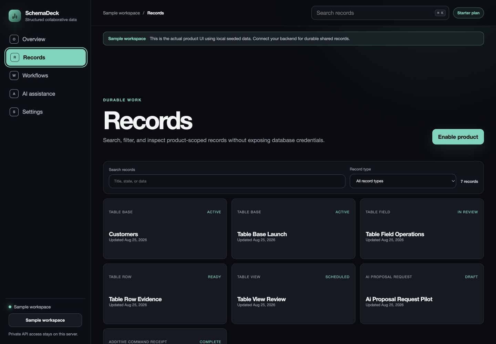

# SchemaDeck

Governed schemas, typed rows, deterministic views, and cited proposals in one shared data fabric.

SchemaDeck is a focused, public MIT distribution for the `tables` module in [managed-oss-cloud](https://github.com/rohanarun/managed-oss-cloud). It includes a product web UI, a product-scoped HTTP client, the `schemadeck` CLI, and a stdio MCP server exposing only this product's 9 typed actions.



## Functional tutorial

[Watch the real-backend product tutorial](./docs/tutorial.mp4) · [Download subtitles](./docs/tutorial.srt) · [Inspect functional proof](./docs/tutorial-proof.json)

The tutorial is captured from this product's actual browser UI against an isolated shared backend. Publication requires a successful guided action, an HTTP 200 durable-record readback, the exact record reopened in the UI, Gemini-generated explanations through OpenRouter, burned-in step captions, and matching artifact hashes.

## Product v1 boundary

This release is declared-action complete: every typed action in this repository's product manifest is exposed through guided schema-driven browser forms with paginated durable record summaries, detail-only payload reads, workflow groups, AI proposal surfaces, connection settings, CLI parity, and MCP parity. The screenshot above is captured from the actual application while it is connected to the shared authenticated backend and displaying records created through real product actions.

That boundary does not claim feature parity with any unrelated mature third-party product. Provider adapters, external delivery, customer-selected storage, legal review, and other category-specific stop lines remain explicit in the [suite acceptance matrix](https://github.com/rohanarun/managed-oss-cloud/blob/main/docs/product-v1-acceptance.md).

## Current boundary

This repository is runnable, but it is intentionally not a second database server. Authentication, workspace isolation, shared PostgreSQL storage, plan enforcement, AI execution, and audit records remain behind the managed-oss-cloud API. This product receives a scoped API token and cannot receive database credentials or run database migrations.

- Hosted backend: `https://cloud.getsupers.com`
- Self-hosted backend: any compatible managed-oss-cloud v0.4.4 deployment
- Hosted minimum plan: `starter`
- Resource class: `shared`
- Pinned backend source: [v0.4.4](https://github.com/rohanarun/managed-oss-cloud/tree/v0.4.4) at `148abce99b91d8b9fdc8aa41c3f0eba283796db4`

## AI-native by construction

- Version-pinned schema proposals
- Deterministic formulas
- No model-applied row or schema changes

AI actions use their own `ai` token scope, preserve the typed action contract, and return durable backend job evidence. They do not grant the model database credentials or bypass approval, plan, tenant, or action boundaries.

## Run the CLI

Node.js 20 or newer is the only local dependency.

```bash
npm install
npm link
export SCHEMADECK_TOKEN="a-scoped-workspace-token"
export SCHEMADECK_URL="https://cloud.getsupers.com"
schemadeck actions
schemadeck workspace
schemadeck page '{"limit":50,"state":"active","search":"Title prefix"}'
schemadeck detail '00000000-0000-4000-8000-000000000001'
schemadeck action base-create '{"key":"customers","name":"Customers","purpose":"Track opted-in customer facts","idempotencyKey":"tables.base-create.example-0001"}'
```

The generic `SUPERSUITE_TOKEN` and `SUPERSUITE_URL` variables are supported as fallbacks. Create a token in the workspace dashboard with only the `read`, `write`, and/or `ai` scopes the client needs.

## Run the web UI

The UI proxies requests through the local Node server so the workspace API token is never sent to the browser. Browser access is protected by a separate key of at least 24 characters.

```bash
export SCHEMADECK_TOKEN="a-scoped-workspace-token"
export SCHEMADECK_URL="https://cloud.getsupers.com"
export SCHEMADECK_WEB_KEY="a-separate-random-browser-key"
npm start
```

Open `http://127.0.0.1:4173`. Put the service behind TLS and an authenticated reverse proxy before exposing it to a network.

To explore the complete product UI without a backend account, start the clearly labeled local sample workspace:

```bash
npm run demo
```

Open `http://127.0.0.1:4173` and connect with `sample-workspace-key-2026`. Sample mode is only a UI fixture; backend and persistence acceptance is tested separately against managed-oss-cloud.

Docker runs the same server:

```bash
docker build -t schemadeck:0.3.1 .
docker run --rm -p 4173:4173 \
  -e SCHEMADECK_TOKEN \
  -e SCHEMADECK_URL \
  -e SCHEMADECK_WEB_KEY \
  schemadeck:0.3.1
```

## Connect the MCP server

The MCP server uses newline-delimited JSON-RPC over stdio and implements `initialize`, `ping`, `tools/list`, and `tools/call`. It advertises five product utilities, including paginated record list and detail reads, plus the 9 product action tools with their pinned JSON input schemas.

```json
{
  "mcpServers": {
    "schemadeck": {
      "command": "schemadeck-mcp",
      "env": {
        "SCHEMADECK_TOKEN": "a-scoped-workspace-token",
        "SCHEMADECK_URL": "https://cloud.getsupers.com"
      }
    }
  }
}
```

## Self-host the backend

```bash
git clone https://github.com/rohanarun/managed-oss-cloud.git
cd managed-oss-cloud
git checkout v0.4.4
# Follow that repository's PostgreSQL, migration, TLS, and runtime instructions.
```

Then point `SCHEMADECK_URL` at the self-hosted control-plane origin. All products may share the same backend and PostgreSQL cluster while the backend preserves workspace and module boundaries.

## Typed action catalogue

| Action ID | Capability | Token scope | Operation |
|---|---|---|---|
| `base-create` | Create governed base | `write` | `command` |
| `field-add` | Add typed field | `write` | `command` |
| `row-create` | Create validated row | `write` | `command` |
| `row-update` | Update row with optimistic lock | `write` | `command` |
| `view-create` | Create deterministic view | `write` | `command` |
| `import-preview` | Preview typed row import | `read` | `read` |
| `import-apply` | Apply approved typed row import | `write` | `command` |
| `formula-evaluate` | Evaluate bounded aggregate | `read` | `read` |
| `schema-propose` | Queue grounded schema proposal | `ai` | `ai` |

The complete machine-readable module definition, JSON input schemas, MCP tool names, examples, and release provenance are pinned in [product-manifest.json](./product-manifest.json).

## Clean-room statement

Original clean-room implementation of the structured collaborative data software category, designed and written independently. Public category behavior informed the requirements, but the product name, implementation, UI, CLI, MCP surface, tests, and documentation in this repository are original. No third-party product source code, assets, copied interface, trademarks, or branding are included.

## Security

- Use a distinct, least-privilege workspace API token per deployment.
- Never place the API token in browser code, Git history, container images, or logs.
- Keep the web server on loopback unless it is behind TLS and authentication.
- Rotate a token immediately if it is exposed.
- Treat AI output as a proposal unless the action contract explicitly records approval and execution boundaries.

See [SECURITY.md](./SECURITY.md) for vulnerability reporting and the trust boundary.

## Development

```bash
npm test
npm run verify
npm run verify:screenshot
npm run verify:tutorial
npm pack --dry-run
```

The repository tests prove bearer authentication, fixed module routing, summary-only pagination, detail-only payload reads, server-side search and filters, input validation, every declared action's HTTP/CLI/MCP registration, sample-workspace behavior, web-key protection, server-side token handling, and the captured PNG's format and dimensions. Durable backend behavior and tenant isolation remain covered by managed-oss-cloud's PostgreSQL and application acceptance suites.

## License

[MIT](./LICENSE)
